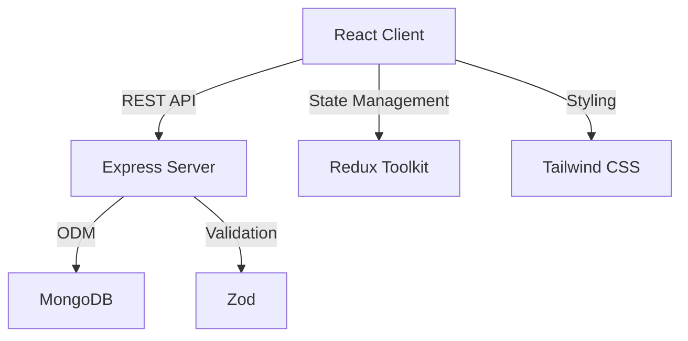

# Minimal Library Management System

A robust, full-stack library management system built with the MERN stack (MongoDB, Express, React, Node.js) and TypeScript. This project enables efficient management of library resources, including book inventory, borrowing, and summary tracking, all through a modern, responsive web interface.

---

## Table of Contents
- [Features](#features)
- [Architecture](#architecture)
- [Tech Stack](#tech-stack)
- [Getting Started](#getting-started)
  - [Prerequisites](#prerequisites)
  - [Installation](#installation)
  - [Environment Variables](#environment-variables)
  - [Running the Application](#running-the-application)
- [Usage](#usage)
- [API Overview](#api-overview)
- [Project Structure](#project-structure)
- [Deployment](#deployment)
- [Contributing](#contributing)
- [FAQ](#faq)
- [License](#license)
- [Author](#author)

---

## Features

- **Book Management**: Add, edit, delete, and list books with details (title, author, genre, ISBN, description, copies, availability).
- **Borrowing System**: Borrow books, track due dates, and update book availability automatically.
- **Borrow Summary**: View a summary of all borrowed books and their total quantities.
- **Pagination**: Efficiently browse large book collections.
- **Responsive UI**: Clean, modern interface built with React, Tailwind CSS, and Radix UI components.
- **API Validation**: Robust backend validation using Zod.
- **Type Safety**: End-to-end TypeScript for both client and server.
- **RESTful API**: Well-structured endpoints for all core operations.
- **Environment-based Configuration**: Easily switch between development and production.
- **Ready for Deployment**: Vercel configuration included.

---

## Architecture



---

## Tech Stack

- **Frontend**: React, TypeScript, Vite, Redux Toolkit, React Router, Tailwind CSS, Radix UI, Zod
- **Backend**: Node.js, Express, TypeScript, Mongoose, MongoDB, Zod, CORS, dotenv
- **Dev Tools**: ESLint, ts-node-dev, Vercel (for deployment)

---

## Getting Started

### Prerequisites
- Node.js (v18+ recommended)
- npm or pnpm
- MongoDB instance (local or cloud)

### Installation

#### 1. Clone the Repository
```bash
git clone https://github.com/tajbid-panthom/Minimal-Library-Management-System.git
cd Minimal-Library-Management-System
```

#### 2. Install Dependencies
- **Server:**
  ```bash
  cd server
  npm install
  ```
- **Client:**
  ```bash
  cd ../client
  pnpm install
  ```

### Environment Variables

- **Server:** Create a `.env` file in the `server` directory:
  ```env
  PORT=8080
  MONGO_URI=mongodb://localhost:27017/library
  ```
- **Client:** Create a `.env` file in the `client` directory:
  ```env
  VITE_API_URL=http://localhost:8080/
  ```

### Running the Application

- **Start the Server:**
  ```bash
  cd server
  npm run dev
  ```
  The server will run on `http://localhost:8080`.

- **Start the Client:**
  ```bash
  cd ../client
  pnpm dev
  ```
  The client will run on `http://localhost:5173`.

---

## Usage

- **All Books:** View all books in the library.
- **Add Books:** Add new books to the collection.
- **Edit/Delete:** Update or remove existing books.
- **Borrow:** Borrow available books and set due dates.
- **Borrow Summary:** View a summary of all borrowed books.

---

## API Overview

### Book Endpoints
- `GET /books` — List all books (supports pagination and filtering)
- `POST /books` — Add a new book
- `PUT /books/:id` — Edit a book
- `DELETE /books/:id` — Delete a book

### Borrow Endpoints
- `POST /borrow` — Borrow a book
- `GET /borrow` — Get borrow summary

All endpoints return JSON responses. See the code for request/response details.

---

## Project Structure

```
Minimal-Library-Management-System/
  client/   # React frontend
  server/   # Express backend
```

- **client/**: Contains all frontend code (React, Redux, UI components, pages, etc.)
- **server/**: Contains all backend code (Express, models, controllers, routes, etc.)

---

## Deployment

- The project is ready for deployment on Vercel (see `vercel.json` in both `client` and `server`).
- Update environment variables as needed for production.
- For custom domains or cloud MongoDB, update the `MONGO_URI` and `VITE_API_URL` accordingly.

---

## Contributing

Contributions are welcome! To contribute:
1. Fork the repository
2. Create a new branch (`git checkout -b feature/your-feature`)
3. Commit your changes (`git commit -m 'Add some feature'`)
4. Push to the branch (`git push origin feature/your-feature`)
5. Open a Pull Request

Please follow the code style and add tests where appropriate.

---

## FAQ

**Q: Can I use a cloud MongoDB instance?**  
A: Yes! Just update the `MONGO_URI` in your server `.env` file.

**Q: How do I change the API URL for the client?**  
A: Update `VITE_API_URL` in the client `.env` file.

**Q: Is authentication included?**  
A: No, this is a minimal system. You can extend it with authentication as needed.

**Q: How do I deploy to Vercel?**  
A: Push your code to GitHub and connect the repo to Vercel. Both `client` and `server` have `vercel.json` for configuration.

---

## License

This project is open source and available under the [MIT License](LICENSE).

---

## Author & Credits

Built with ❤️ by [Tajbid Hossain](https://github.com/tajbid-panthom)

---

[GitHub Repository](https://github.com/tajbid-panthom/Minimal-Library-Management-System)
